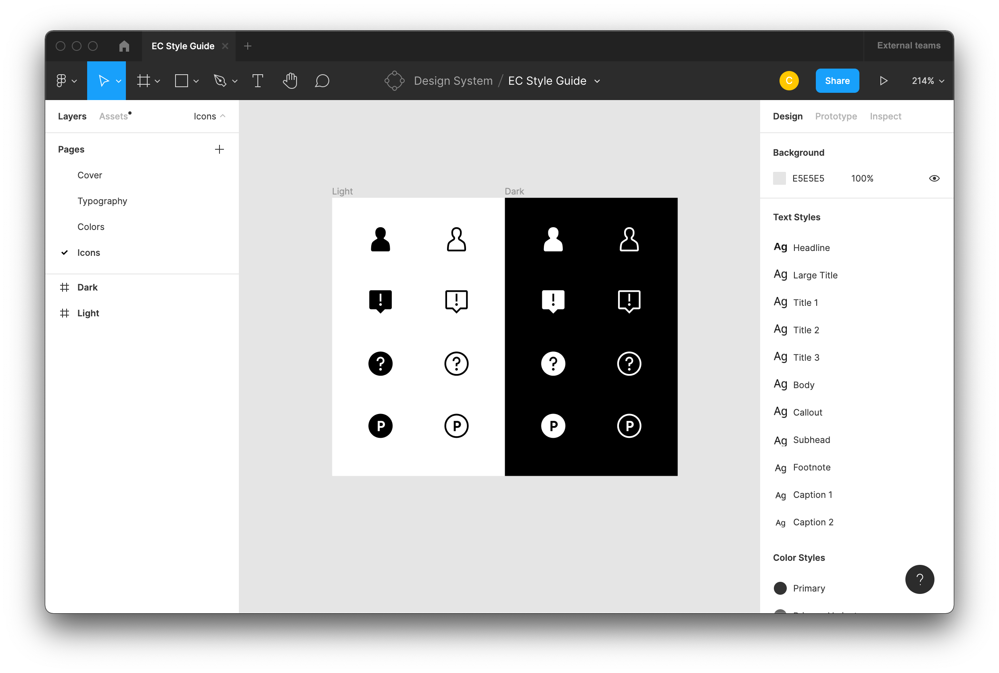
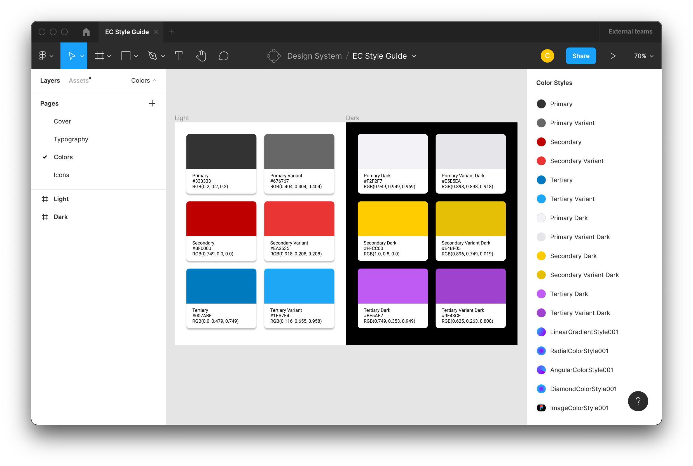
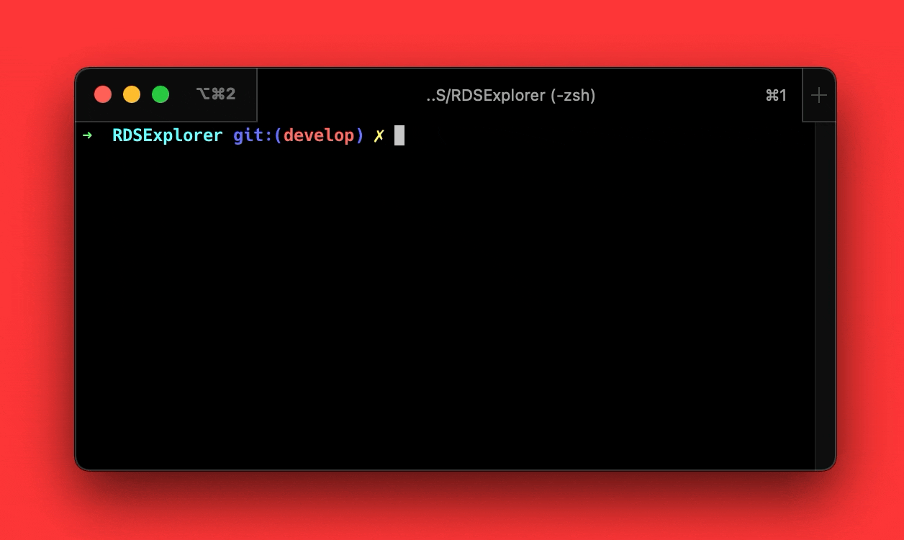
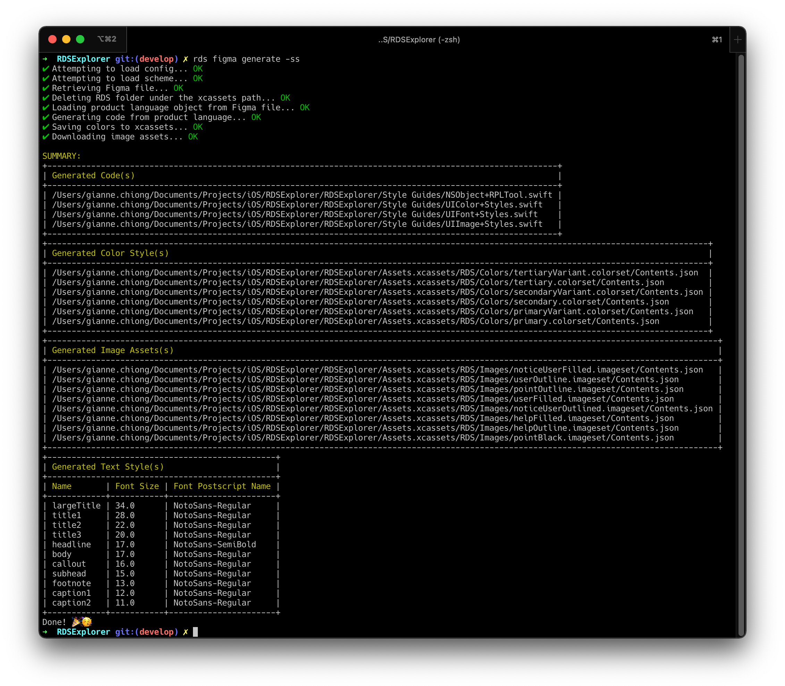
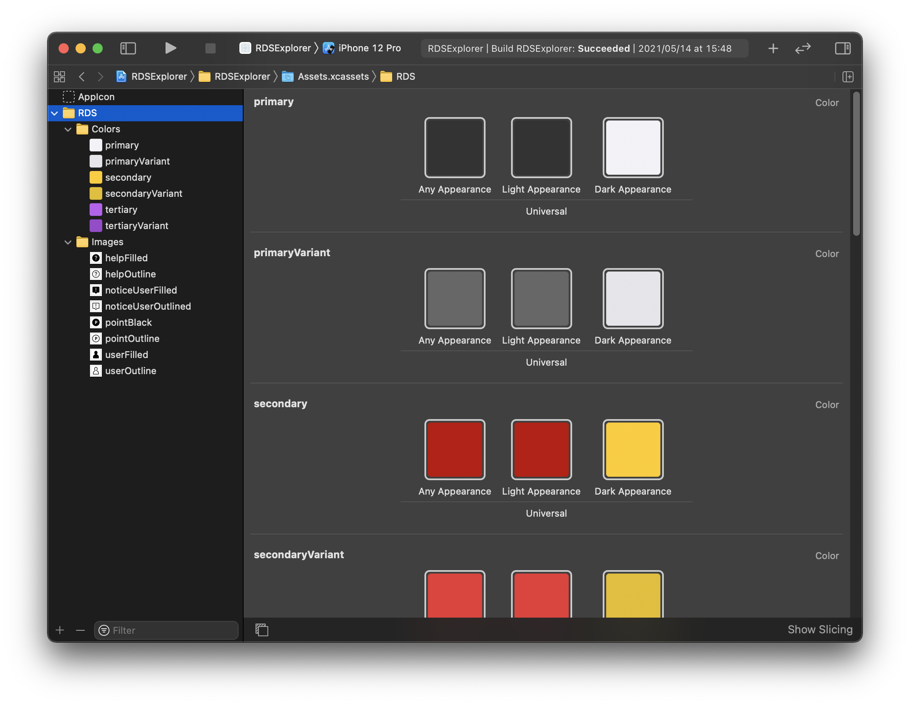
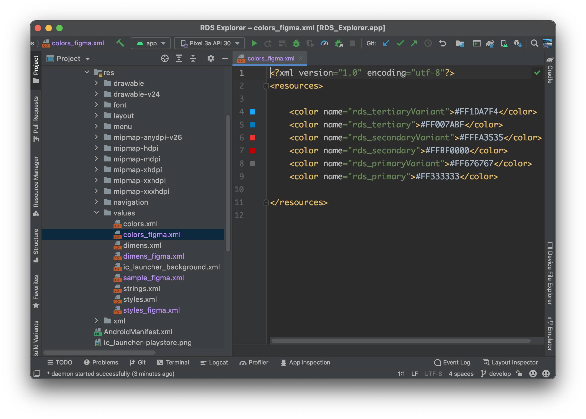
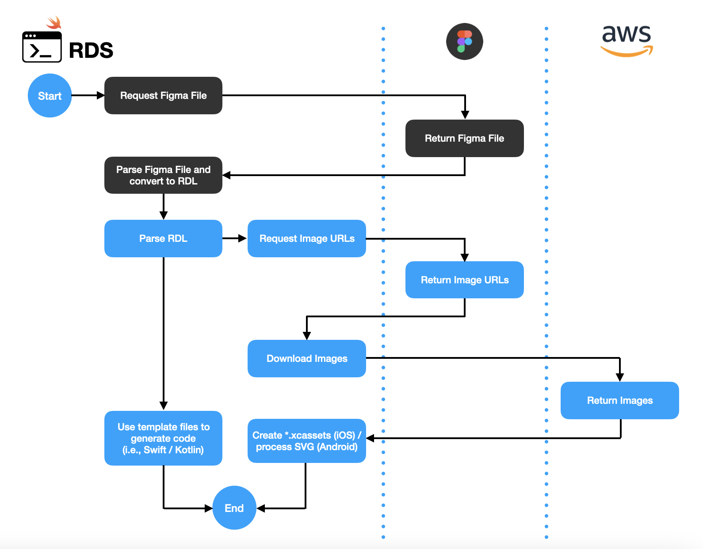
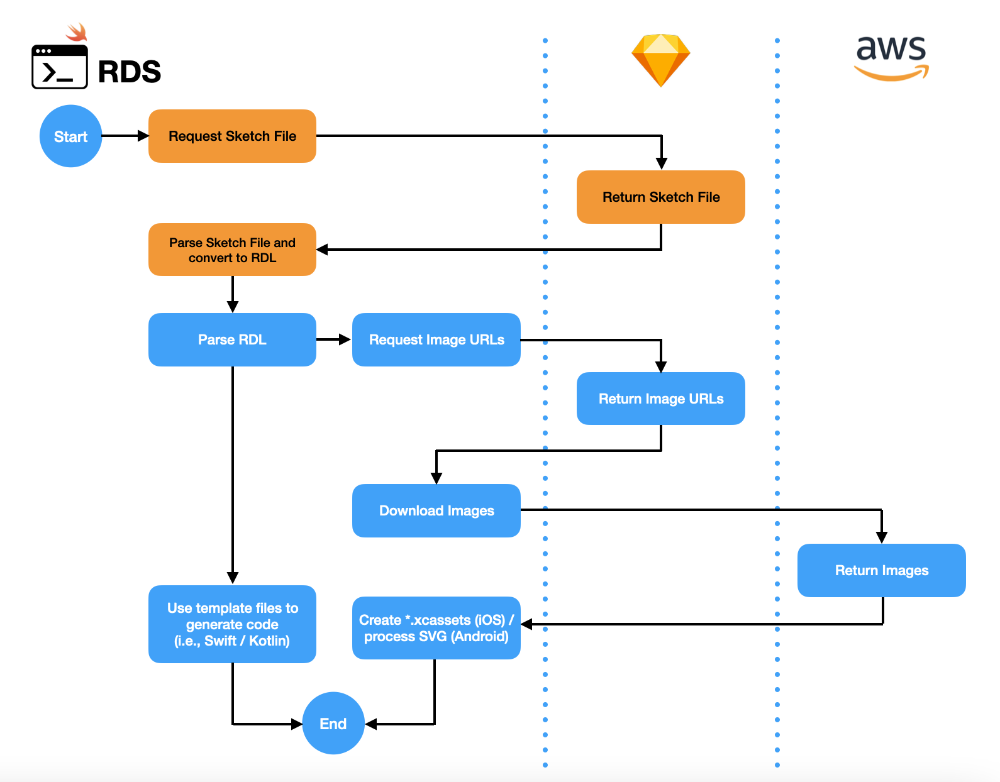

Hi, this is Gian from the E-Commerce Mobile Architect Group. The mission of our group is to improve productivity by creating tools to automate tasks and providing technical support for the e-commerce mobile app development teams. In this article, we will discuss about one of the developer tools we created to automate designer-to-developer handoff.

## Overview

Designer-to-developer handoff is an important part of the product development life cycle. It takes place when the design deliverables are ready to be provided to developers for implementation.

In the E-Commerce Mobile App Development Department, the design deliverables are mainly created using [Figma](https://www.figma.com). The design in Figma is considered as the single-source-of-truth from which the app development team derives the product's UI. As such, it is critical to ensure that it is formatted in a way that can be clearly understood by the developers to avoid any inconsistencies between the design and the final product.

## Design Deliverable Prerequisites

Our designers prepare the design deliverables following a few general guidelines. Here are a couple of examples.

- Assets that are intended to be exported into an image format are converted into a Figma Component and laid out in a separate page and/or frame. Likewise, typography and color styles are also defined as Figma Styles, and representations of these styles are also shown in dedicated pages and/or frames.

| Sample Style Guide |                                                                                     |
| ------------------ | ----------------------------------------------------------------------------------- |
| Icons              | [](./images/figma_icons.png)                |
| Colors             | [](./images/figma_colors.png)             |
| Typography         | [](./images/figma_typography.png) |

- No ad-hoc use of images, colors, or font styles that are not defined as components or styles in Figma. Using predefined components and styles reduces the chance of having unintentional variations (e.g., multiple unintended shades of reds, etc.) across the entire design file.

| Typography and Color without using Figma Styles ❌                   | Typography and Color using Figma Styles ⭕️                             |
| -------------------------------------------------------------------- | ----------------------------------------------------------------------- |
| [](./images/ui_no_style.png) | [(./images/ui_with_style.png) |

## RDS

To help with the seamless adoption of the design into our iOS/Android development projects, we have developed an in-house command-line interface tool called RDS (Rakuten Design System) to automate the following processes:

1. Exporting of image assets, color and typography styles from Figma
2. Importing of assets and styles from (1) into the iOS/Android projects
3. Generating helper codes for programmatically using the assets and styles imported in (2).

Once the Figma designs are ready, the developer uses RDS to grab the assets and styles from Figma and import it to their projects. The tool reads a config file (e.g., FigmaConfig.yml) to know which Figma file to process along with some customization options.

- Sample FigmaConfig.yml
  ```yaml
  schemes:
    - schemeID: 1
      schemeDescription: EC Style Guide
      teamID: <team_id>
      projectID: <project_id>
      fileID: <file_id>
      templatesPath: ./RDSExplorer/Templates/
      codePath: ./RDSExplorer/Style Guides/
      platform: iOS
      assetsPath: ./RDSExplorer/Assets.xcassets
      imageAssetsFormat: pdf
      textStylesFrames:
        - Typography
      colorStylesFrames:
        - Colors
      imageComponentsFrames:
        - Icons
  selectedSchemeID: 1
  ```

To get the latest assets and styles from Figma, all the developer needs to do is run RDS on the project directory.

- RDS in action
  [](./images/automating-code-and-asset-generation-from/rds_figma_generate.gif)

- RDS with the option to show a summary of the generated assets and styles from Figma
  [](./images/automating-code-and-asset-generation-from/rds_figma_generate_ss.png)

Under the hood, RDS performs the following:

**1.** Retrieve the Figma file using the [Figma API](https://www.figma.com/developers/api#files-endpoints)

**2.** Convert the Figma file into an intermediary format we internally named **RDL** (Rakuten Design Language)
[](./images/automating-code-and-asset-generation-from/RDL.jpg)

**3.** Use template files to generate code from the RDL model. The code generated can be any programming language depending on the template file. Below is an example of a template file that generates a Swift file.

_UIColor+RDS.swift.stencil_

```swift
// auto-generated by RDS

import UIKit

extension UIColor {
    struct rds {
        
        static let {{ colorStyle.name }} = UIColor(named: "{{ colorStyle.name }}")
        
    }
}
```

_UIColor+RDS.swift_

```swift
// auto-generated by RDS

import UIKit

extension UIColor {
    struct rds {
        static let tertiaryVariant = UIColor(named: "tertiaryVariant")
        static let tertiary = UIColor(named: "tertiary")
        static let secondaryVariant = UIColor(named: "secondaryVariant")
        static let secondary = UIColor(named: "secondary")
        static let primaryVariant = UIColor(named: "primaryVariant")
        static let primary = UIColor(named: "primary")
    }
}
```

**4.** Download the assets, process if needed, and import them into the development project.

- For iOS, the image assets and color styles are automatically added to the \*.xcassets folder.
  [](./images/automating-code-and-asset-generation-from/xcode_assets.png)
- For Android, the image assets and color styles are automatically added to the project's resource directory.
  [](./images/automating-code-and-asset-generation-from/colors_figma.png)

Here's a simplified diagram showing the flow:

[](./images/automating-code-and-asset-generation-from/rds_flow_figma.png)

## Further Expansion

By using an intermediary format (RDL), we can add support for other design files by only modifying the steps leading up to the conversion of the design file into the RDL format. For instance, if we were to add support for Sketch files, theoretically, only specific parts of the flow will have to change as shown in the diagram below.
[](./images/automating-code-and-asset-generation-from/rds_flow_sketch.png)

## Conclusion

**RDS** is just one of the internal tools that we have developed to help us automate tasks that are otherwise done manually. It helps developers stay in sync with the design files created by our designers.
It initially started as a one-off tool meant for our iOS projects under Rakuten Commerce TECH. However, it's now part of the workflow for our Android projects as well.
